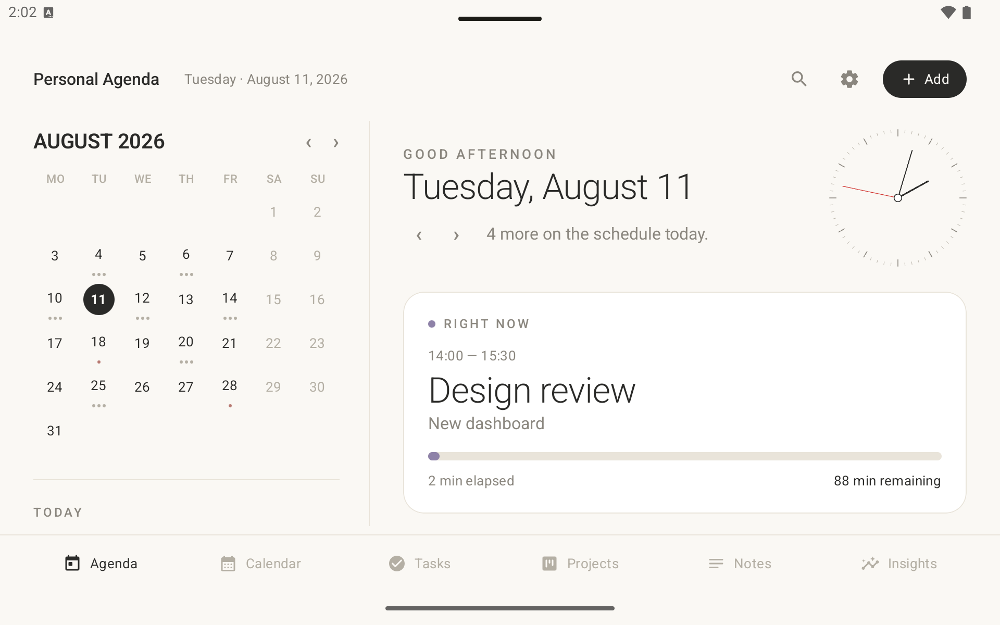
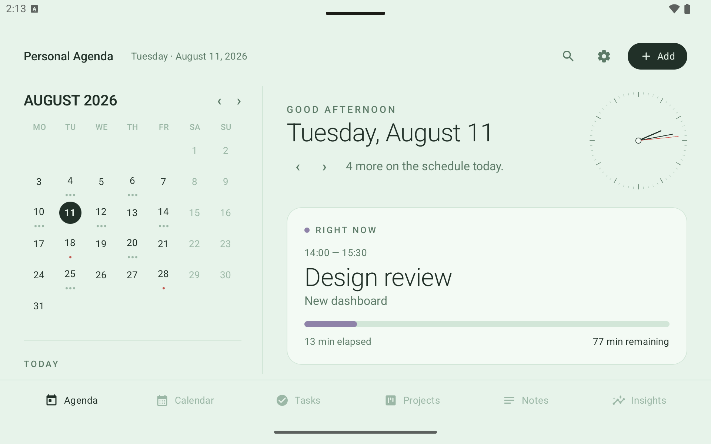
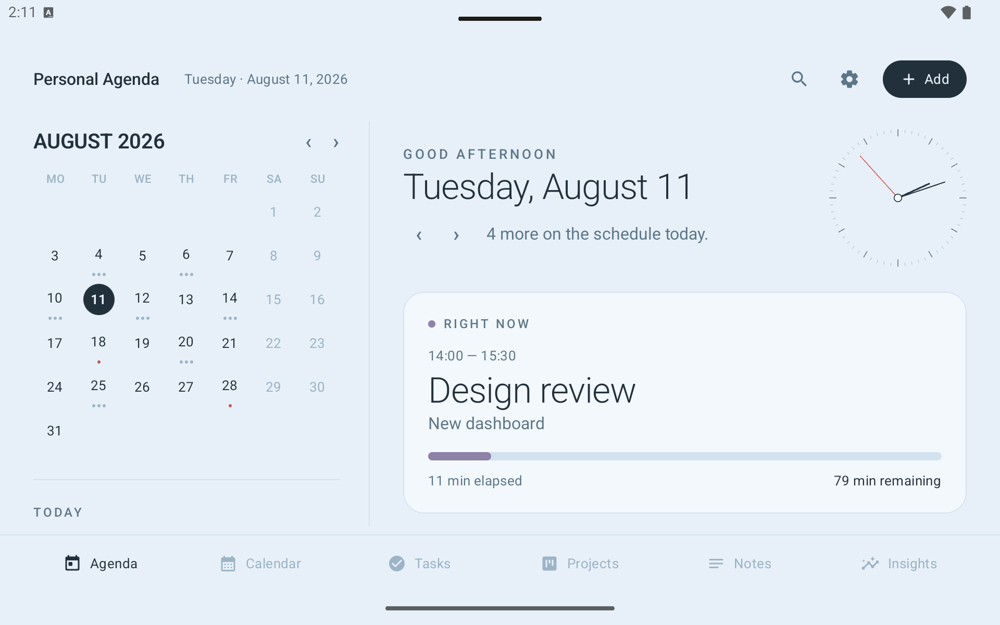

# Personal Agenda

A calm, elegant day‑planner for Android tablets — your calendar, tasks, projects,
notes and reflections in one beautifully organized place.



## What it does

Personal Agenda is designed to answer three questions the moment you open it:

- **Where am I in time?** — a live date, a real‑time analog clock, and a month calendar.
- **What's happening now?** — the signature **Right Now** card shows your current event
  with a live progress bar, and gracefully becomes *Up Next* or *Day complete* as the day unfolds.
- **What deserves my attention?** — today's focus, tasks, projects and a quick note, all at a glance.

## Screens

- **Agenda** — the dashboard above: month calendar, Right Now, a journal‑style timeline with a
  live "now" marker, plus focus, tasks, projects and a quick note. Step through days with ‹ ›.
- **Calendar** — a paper‑agenda weekly spread: a grid of day cells (untimed tasks on the
  left, timed events on the right), scrollable per day, paging two weeks at a time.
- **Tasks** — grouped into Today / Upcoming / Someday / Completed.
- **Projects** — cards whose progress is driven by their linked tasks (JIRA‑style), with
  status, next action and an optional deadline.
- **Notes** — quick notes you can link to a project, event or task.
- **Insights** — a calm weekly look‑back (time scheduled, tasks done, workload). No streaks, no pressure.

## Themes

Choose a look in **Settings** — System, Light, Dark, or one of four fun colors.

| Mint | Sky |
| --- | --- |
|  |  |

## A few nice touches

- A real‑time analog clock right on the dashboard
- Everything is saved on your device and survives restarts
- Add anything in a tap with **+ Add** — events, tasks or notes, on any date you pick
- Optional **Google‑account sync** — sign in from Settings and your agenda syncs live across devices
- Search across everything from the top bar
- Designed landscape‑first for tablets, with a dedicated portrait layout

## Built with

Kotlin · Jetpack Compose (Material 3) · Room · Firebase (Auth + Cloud Firestore) for sync.
Runs on Android 8.0 (API 26) and up.

## Firebase setup (required to build)

This repo does **not** include `app/google-services.json` (it's specific to a Firebase
project and is git‑ignored). To build, create your own free Firebase project and add it:

1. In the [Firebase console](https://console.firebase.google.com/), create a project and add
   an **Android app** with package name `com.personalagenda.app`.
2. Under **Authentication → Sign‑in method**, enable **Google**; under **Project settings**,
   add your signing **SHA‑1** fingerprint (for the debug build, the one from
   `keytool -list -v -keystore ~/.android/debug.keystore -alias androiddebugkey -storepass android`).
3. Create a **Firestore Database**, and publish the rules in [`firestore.rules`](firestore.rules).
4. Download **`google-services.json`** into the `app/` folder.

The app runs fully offline without signing in; Firebase is only used when you sign in to sync.

## Running from source

Open the project in **Android Studio**, let it sync, then press **Run** on a tablet
emulator or a connected device. If Gradle complains about the Java version, set
**Settings → Build Tools → Gradle → Gradle JDK** to 17 or 21.

## Building an installable APK

### Quickest — a debug APK (no setup)

From the project folder:

```bash
./gradlew assembleDebug
```

The file lands at:

```
app/build/outputs/apk/debug/app-debug.apk
```

Copy it to your tablet (USB, Google Drive, email…) and tap it to install — you'll be asked
to allow "Install unknown apps" for whatever app you opened it from. This is the easiest way
to get it onto your own device.

_If the build complains about the Java version, point it at JDK 17:_

```bash
JAVA_HOME=/Library/Java/JavaVirtualMachines/jdk-17.jdk/Contents/Home ./gradlew assembleDebug
```

